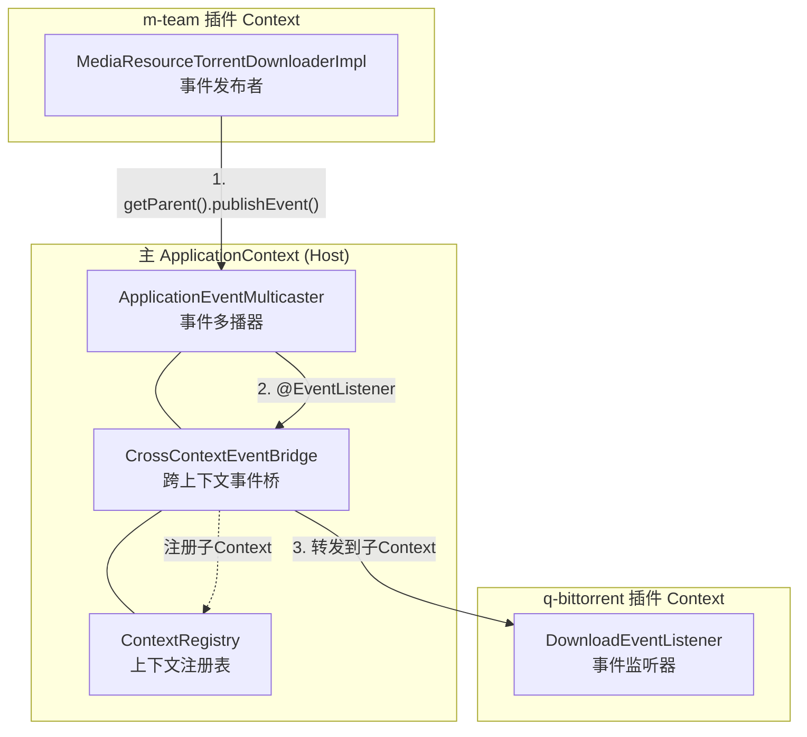
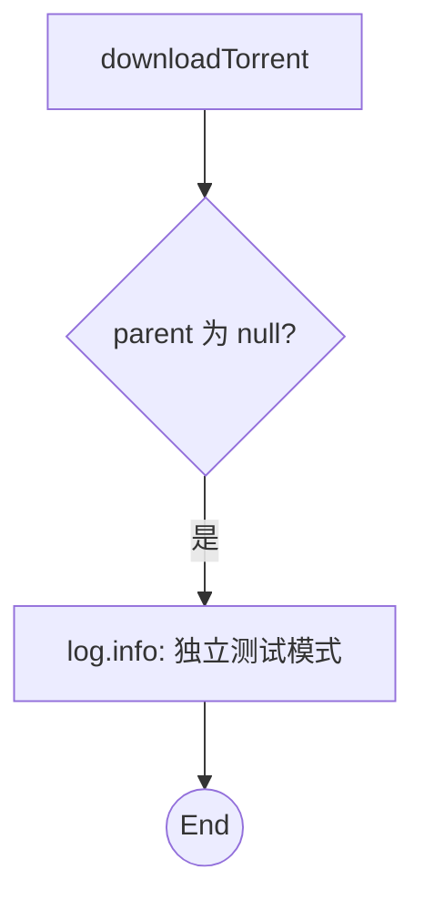
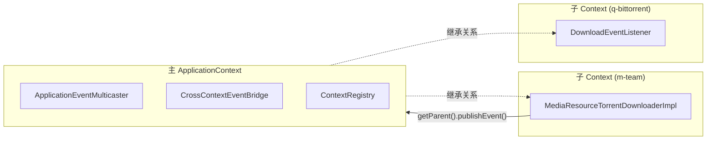
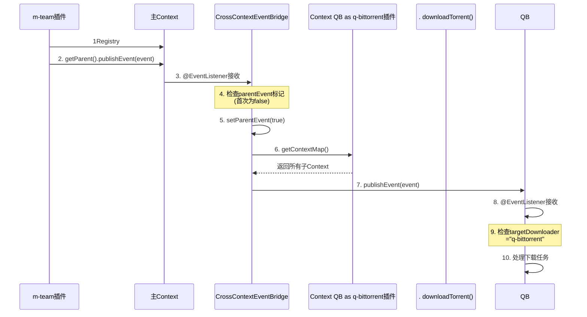
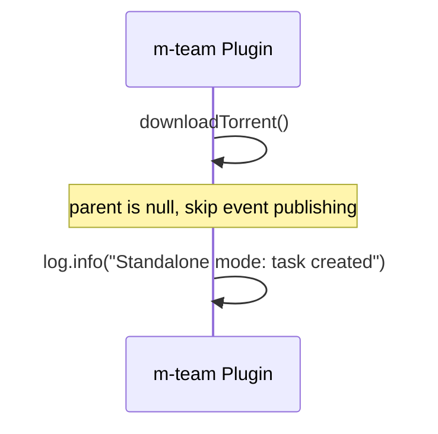
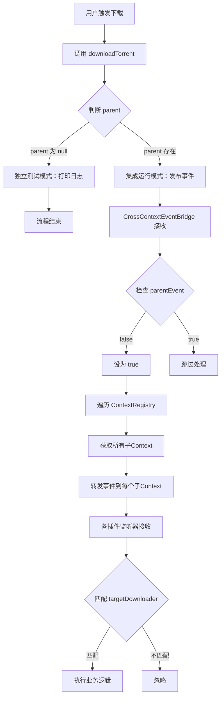

# Follow-Movie 事件发布/订阅流程

> 最后更新: 2026-02-27

---

## 1. 系统架构 Overview

### 集成运行模式

### 独立测试模式

---

## 2. Spring Context 层级

---

## 3. 事件流转时序

### 集成运行模式

### 独立测试模式

---

## 4. 核心组件

| 组件 | 位置 | 角色 |
|------|------|------|
| `DownloadEvent` | common-api | 事件载体 |
| `MediaResourceTorrentDownloaderImpl` | plugins/media-fetch/m-team | Publisher 发布者 |
| `CrossContextEventBridge` | follow-movie-web | Bridge 桥接器 |
| `ContextRegistry` | follow-movie-web | Registry 注册表 |
| `DownloadEventListener` | plugins/media-download/q-bittorrent | Subscriber 订阅者 |

---

## 5. 事件流程步骤

---

## 6. 相关文件

| 文件 | 路径 |
|------|------|
| 事件定义 | `common-api/src/main/java/com/yx/nas/model/event/DownloadEvent.java` |
| 事件发布者 | `plugins/media-fetch/m-team/src/main/java/.../MediaResourceTorrentDownloaderImpl.java` |
| 事件桥接器 | `follow-movie-web/src/main/java/com/yx/nas/tool/context/CrossContextEventBridge.java` |
| 上下文注册表 | `follow-movie-web/src/main/java/com/yx/nas/tool/context/ContextRegistry.java` |
| 事件监听器 | `plugins/media-download/q-bittorrent/src/main/java/.../DownloadEventListener.java` |

---

*文档由 Claude Code 自动生成*
